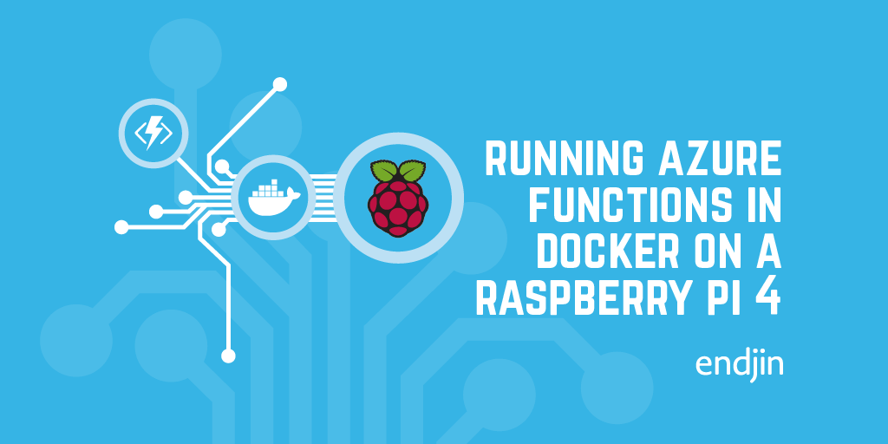

# Azure Functions + Docker + Raspberry Pi Demo app

A simple "hello world" demo app to go with my blog post on running Azure functions on a Raspberry Pi.

[See the full blog post here - https://blogs.endjin.com/2019/09/running-azure-functions-in-docker-on-a-raspberry-pi-4/](https://blogs.endjin.com/2019/09/running-azure-functions-in-docker-on-a-raspberry-pi-4/)